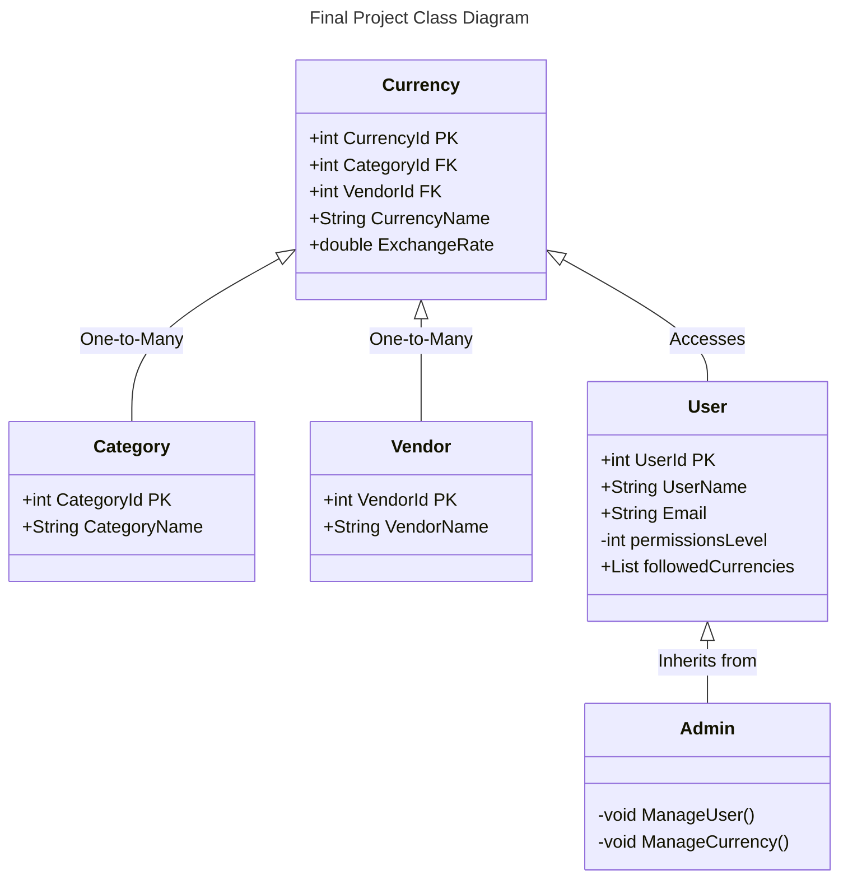

```mermaid
---
title: Final Project Class Diagram
---
classDiagram
    Currency <|-- Category : One-to-Many
    Currency <|-- Vendor : One-to-Many
    Currency <|-- User : Accesses
    User <|-- Admin : Inherits from
    class Currency{
        +int CurrencyId PK
        +int CategoryId FK
        +int VendorId FK
        +String CurrencyName
        +double ExchangeRate
    }
    class Category{
        +int CategoryId PK
        +String CategoryName
    }
    class Vendor{
        +int VendorId PK
        +String VendorName
    }
    class User{
        +int UserId PK
        +String UserName
        +String Email
        -int permissionsLevel
        +List<Currency> followedCurrencies
    }
    class Admin{
        -void ManageUser()
        -void ManageCurrency()
    }
```
