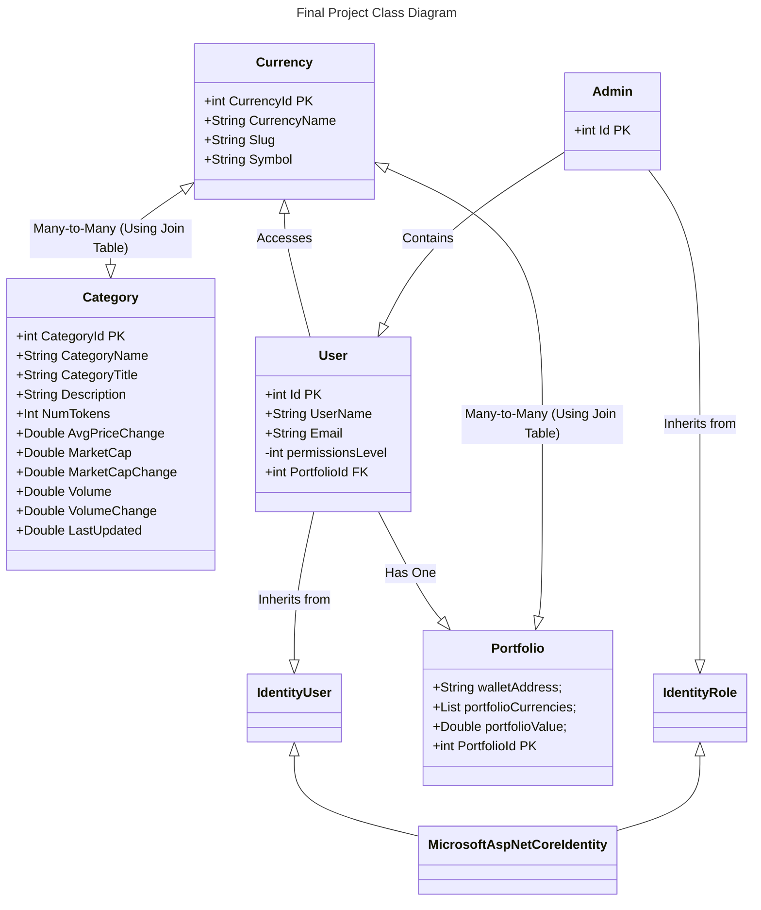

```mermaid
---
title: Final Project Class Diagram
---
classDiagram
    Currency <|--|> Category : Many-to-Many (Using Join Table)
    Currency <|-- User : Accesses
    Admin --|> IdentityRole : Inherits from
    User --|> Portfolio : Has One
    User --|> IdentityUser : Inherits from 
    IdentityUser <|-- MicrosoftAspNetCoreIdentity
    IdentityRole <|-- MicrosoftAspNetCoreIdentity
    Admin --|> User : Contains
    Currency <|--|> Portfolio : Many-to-Many (Using Join Table)
    class Currency{
        +int CurrencyId PK
        +String CurrencyName
        +String Slug
        +String Symbol
    }
    class Category{
        +int CategoryId PK
        +String CategoryName
        +String CategoryTitle
        +String Description
        +Int NumTokens
        +Double AvgPriceChange
        +Double MarketCap
        +Double MarketCapChange
        +Double Volume
        +Double VolumeChange
        +Double LastUpdated
    }
    class Portfolio{
        +String walletAddress;
        +List<Currency> portfolioCurrencies;
        +Double portfolioValue;
        +int PortfolioId PK
    }
    class User{
        +int Id PK
        +String UserName
        +String Email
        -int permissionsLevel
        +int PortfolioId FK
    }
    class Admin{
        +int Id PK
    }
```
