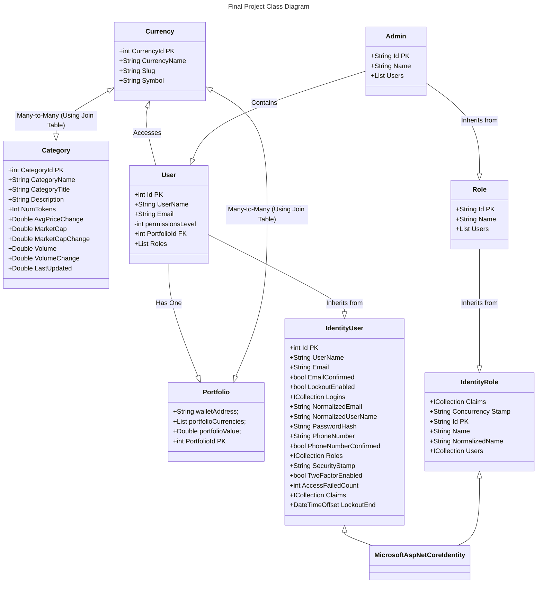

```mermaid
---
title: Final Project Class Diagram
---
classDiagram
    Currency <|--|> Category : Many-to-Many (Using Join Table)
    Currency <|-- User : Accesses
    Admin --|> Role : Inherits from
    User --|> Portfolio : Has One
    User --|> IdentityUser : Inherits from
    IdentityUser <|-- MicrosoftAspNetCoreIdentity
    Role --|> IdentityRole : Inherits from
    IdentityRole <|-- MicrosoftAspNetCoreIdentity
    Admin --|> User : Contains
    Currency <|--|> Portfolio : Many-to-Many (Using Join Table)
    class Currency{
        +int CurrencyId PK
        +String CurrencyName
        +String Slug
        +String Symbol
    }
    class Category{
        +int CategoryId PK
        +String CategoryName
        +String CategoryTitle
        +String Description
        +Int NumTokens
        +Double AvgPriceChange
        +Double MarketCap
        +Double MarketCapChange
        +Double Volume
        +Double VolumeChange
        +Double LastUpdated
    }
    class Portfolio{
        +String walletAddress;
        +List<Currency> portfolioCurrencies;
        +Double portfolioValue;
        +int PortfolioId PK
    }
    class User{
        +int Id PK
        +String UserName
        +String Email
        -int permissionsLevel
        +int PortfolioId FK
        +List<Role> Roles 
    }
    class IdentityUser{
        +int Id PK
        +String UserName
        +String Email
        +bool EmailConfirmed
        +bool LockoutEnabled
        +ICollection<TUserLogin> Logins
        +String NormalizedEmail
        +String NormalizedUserName
        +String PasswordHash
        +String PhoneNumber
        +bool PhoneNumberConfirmed
        +ICollection<TUserRole> Roles
        +String SecurityStamp
        +bool TwoFactorEnabled
        +int AccessFailedCount
        +ICollection<TUserClaim> Claims
        +DateTimeOffset LockoutEnd
    }
    class IdentityRole{
        +ICollection<TRoleClaim> Claims
        +String Concurrency Stamp
        +String Id PK
        +String Name
        +String NormalizedName
        +ICollection<TUserRole> Users
    }
    class Role{
        +String Id PK
        +String Name
        +List<User> Users
    }
    class Admin{
        +String Id PK
        +String Name
        +List<User> Users
    }
```
