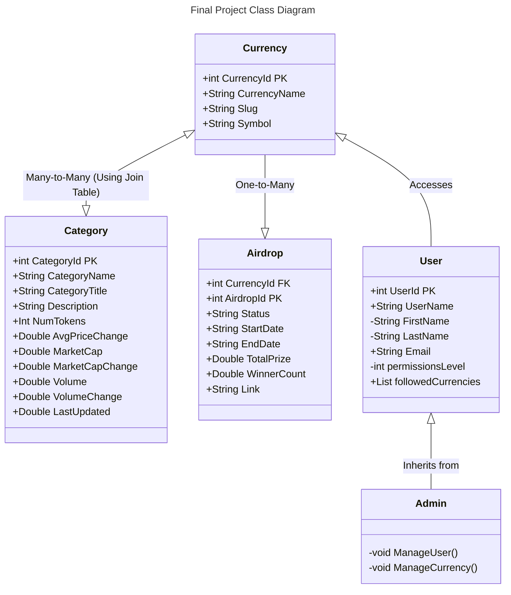

```mermaid
---
title: Final Project Class Diagram
---
classDiagram
    Currency <|--|> Category : Many-to-Many (Using Join Table)
    Currency --|> Airdrop : One-to-Many
    Currency <|-- User : Accesses
    User <|-- Admin : Inherits from
    class Currency{
        +int CurrencyId PK
        +String CurrencyName
        +String Slug
        +String Symbol
    }
    class Category{
        +int CategoryId PK
        +String CategoryName
        +String CategoryTitle
        +String Description
        +Int NumTokens
        +Double AvgPriceChange
        +Double MarketCap
        +Double MarketCapChange
        +Double Volume
        +Double VolumeChange
        +Double LastUpdated
    }
    class Airdrop{
        +int CurrencyId FK
        +int AirdropId PK
        +String Status
        +String StartDate
        +String EndDate
        +Double TotalPrize 
        +Double WinnerCount
        +String Link
    }
    class User{
        +int UserId PK
        +String UserName
        -String FirstName
        -String LastName
        +String Email
        -int permissionsLevel
        +List<Currency> followedCurrencies
    }
    class Admin{
        -void ManageUser()
        -void ManageCurrency()
    }
```
